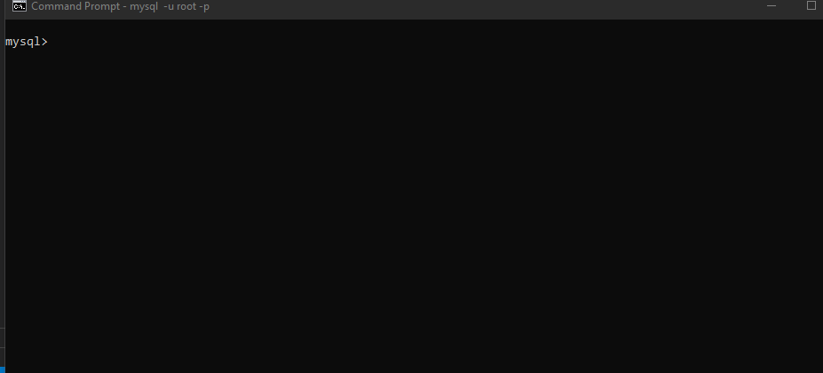
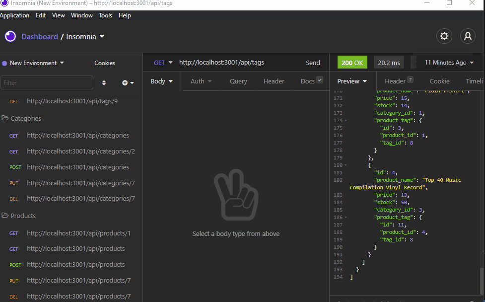

# E_Commerce_Back_End
Back end database manager for e-commerce.  

[](https://opensource.org/licenses/MIT) 

## Description: 
This is an Express.js API that uses Sequelize to interact with a MySQL database. You can use API testing tools to interact with the e-commerce database. The database has tables for products, categories, tags, and product tags.

## Table of Contents: 
* [Installation](#installation)
* [Usage](#usage) 
* [License](#license) 
* [Contributing](#contributing) 
* [Questions](#questions) 

## Installation: 
* You will need to have Node.js and MySQL installed. 
* Run ```npm install``` in your bash terminal to install the dependencies.
* Update your MySQL user and password in the ``` .env.EXAMPLE ``` file then rename it to ``` .env ```. 
* Run ```DROP DATABASE IF EXISTS ecommerce_db;``` and then```CREATE DATABASE ecommerce_db;``` in MySQL shell to create the database in MySQL. 
* Run ```node seeds/index.js``` in your bash terminal to seed the database
* Run ```npm start``` to initialize the server on your local machine, then you can interact with it using an API testing tool such as Postman or Insomnia.  



## Usage: 
  
Use an API testing tool such as Postman or Insomnia to interact with the database.  
 
To view all categories:
  * ```GET http://localhost:3001/api/categories```

To view all products:
  * ```GET http://localhost:3001/api/products```

To view all tags:
  * ```GET http://localhost:3001/api/tags```


To view a single category:
  * ```GET http://localhost:3001/api/categories/:id```
  * ```:id``` is the id of the category you want to view

To view a single product: 
  * ```GET http://localhost:3001/api/products/:id```
  * ```:id``` is the id of the product you want to view

To view a single tag:
  * ```GET http://localhost:3001/api/tags/:id```
  * ```:id``` is the id of the tag you want to view



To create a new categrory:
  * ```POST  http://localhost:3001/api/categories```
  * Enter key/value pairs, refer to models folder for columns.

To create a new product:
  * ```POST  http://localhost:3001/api/products```
  * Enter key/value pairs, refer to models folder for columns.
  * When entering a new product, stock value will default to 10.
  * Use a separate line to enter each tag id, and be sure to include the index in the key. Here is an example if you wish to enter tag ids 3 and 4:
     * ```tagIds[0]: 3```
     * ```tagIds[1]: 4```

To create a new tag:
  * ```POST  http://localhost:3001/api/tags```
  * Enter key/value pairs, refer to models folder for columns.


To alter a single category:
  * ```PUT  http://localhost:3001/api/categories/:id```
  * Enter key/value pairs for the fields you want to change

To alter a single product:
  * ```PUT  http://localhost:3001/api/products/:id```
  * Enter key/value pairs for the fields you want to change.

To alter a single tag:
  * ```PUT  http://localhost:3001/api/tags/:id```
  * Enter key/value pairs for the fields you want to change.

To delete a single category:
  * ```DELETE http://localhost:3001/api/categories/:id```
  *  ```:id``` is the id of the category you want to delete

To delete a single product:
  * ```DELETE http://localhost:3001/api/products/:id```
  *  ```:id``` is the id of the product you want to delete

To delete a single tag:
  * ```DELETE http://localhost:3001/api/tags/:id```
  *  ```:id``` is the id of the tag you want to delete


## License: 
Licensed under the [MIT](https://opensource.org/licenses/MIT) license. 

## Contributing: 
Feel free to contact me to contribute to this project. My contact information is listed below.

## Questions: 
GitHub: [melinamboedecker](https://github.com/melinamboedecker) 

If you have any additional questions, please contact me at melinamboedecker@gmail.com